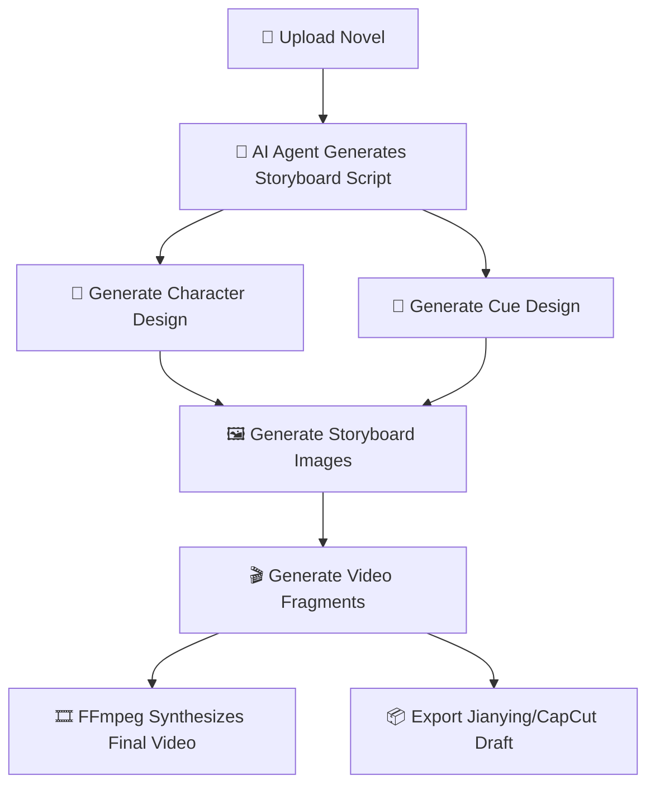
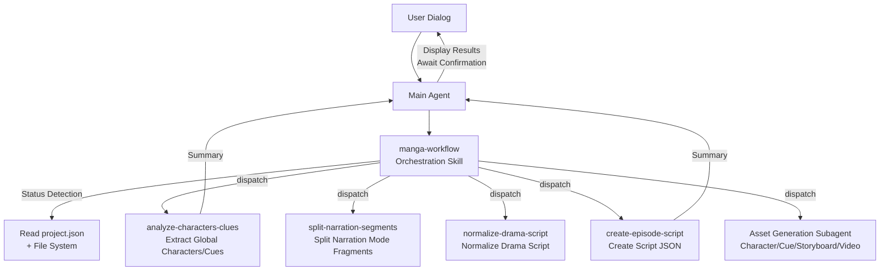
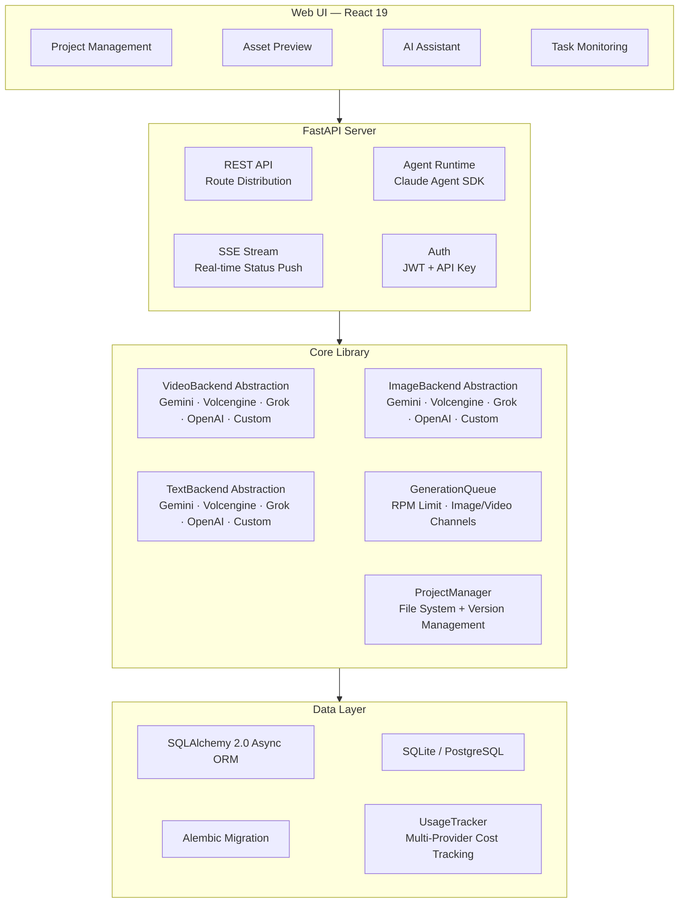

<h1 align="center">
  <br>
  <picture>
    <source media="(prefers-color-scheme: light)" srcset="frontend/public/android-chrome-maskable-512x512.png">
    <source media="(prefers-color-scheme: dark)" srcset="frontend/public/android-chrome-512x512.png">
    
  </picture>
  <br>
  ArcReel
  <br>
</h1>

<h4 align="center">Open-source AI Video Generation Workspace — Novel to Short Video, Powered by AI Agents</h4>

<p align="center">
  <a href="#quick-start"></a>
  <a href="https://github.com/ArcReel/ArcReel/blob/main/LICENSE"></a>
  <a href="https://github.com/ArcReel/ArcReel"></a>
  <a href="https://github.com/ArcReel/ArcReel/pkgs/container/arcreel"></a>
  <a href="https://github.com/ArcReel/ArcReel/actions/workflows/test.yml"></a>
</p>

<p align="center">
  
  
  
  
  
  
  
  
</p>

<p align="center">
  
</p>

---

## Core Capabilities

<table>
<tr>
<td width="20%" align="center">
<h3>🤖 AI Agent Workflow</h3>
Built on <strong>Claude Agent SDK</strong>, orchestrating Skill + focused multi-agent Subagent collaboration, automating the entire production line from script writing to video synthesis.
</td>
<td width="20%" align="center">
<h3>🎨 Multi-Provider Image Generation</h3>
Supports <strong>Gemini</strong>, <strong>Volcengine</strong>, <strong>Grok</strong>, <strong>OpenAI</strong>, and custom providers. Character design ensures role consistency, cue tracking guarantees property/scene continuity across scenes.
</td>
<td width="20%" align="center">
<h3>🎬 Multi-Provider Video Generation</h3>
Supports <strong>Veo 3.1</strong>, <strong>Seedance</strong>, <strong>Grok</strong>, <strong>Sora 2</strong>, and custom providers, switchable at global or project level.
</td>
<td width="20%" align="center">
<h3>⚡ Asynchronous Task Queue</h3>
RPM rate limiting + independent concurrency channels for Image/Video, lease-based scheduling, supports task continuation after interruption.
</td>
<td width="20%" align="center">
<h3>🖥️ Visual Workstation</h3>
Web UI for project management, asset preview, version rollback, real-time SSE task tracking, with built-in AI assistant.
</td>
</tr>
</table>

## Workflow



## Quick Start

### Default Installation (SQLite)

```bash
git clone https://github.com/ArcReel/ArcReel.git
cd ArcReel/deploy
cp .env.example .env
docker compose up -d
# Access http://localhost:1241
```

### Production Installation (PostgreSQL)

```bash
cd ArcReel/deploy/production
cp .env.example .env    # Need to set POSTGRES_PASSWORD
docker compose up -d
```

After first run, login with default account (username `admin`, password set in `.env` via `AUTH_PASSWORD`; if not set, it will be auto-generated on first startup and written back to `.env`), then open **Settings Page** (`/settings`) to complete configuration:

1. **ArcReel Agent** — Configure Anthropic API Key (to power the AI assistant), supports Base URL and model customization.
2. **AI Image/Video** — Configure at least one provider API Key (Gemini / Volcengine / Grok / OpenAI), or add a custom provider.

> 📖 For detailed steps, please refer to [Complete Getting Started Guide](docs/getting-started.md)

## Key Features

- **Complete Production Pipeline** — Novel → Script → Character Design → Storyboard Images → Video Fragments → Final Video, one-click orchestration.
- **Multi-Agent Architecture** — Orchestration Skill detects project status and automatically schedules focused Subagents. Each Subagent completes independent tasks and returns summaries.
- **Multi-Provider Support** — Image/Video/Text support Gemini, Volcengine, Grok, and OpenAI, switchable at global or project level.
- **Custom Providers** — Connect to any API compatible with OpenAI / Google (like Ollama, vLLM, third-party agents), automatic model detection, same functionality as built-in providers.
- **Two Content Modes** — Narration mode splits fragments based on reading rhythm, Drama animation mode arranges based on scene/dialogue structure.
- **Progressive Episode Planning** — Human-machine collaboration for cutting long novels: peak detection → Agent cutting point suggestions → user confirmation → physical cuts, on-demand production.
- **Style Reference Images** — Upload style images, AI will automatically analyze and apply them to all image generation to ensure visual consistency across the project.
- **Character Consistency** — AI generates character designs first, all subsequent storyboards and videos will reference these designs.
- **Cue Tracking** — Key properties or scene elements are marked as "Cues" to maintain visual continuity across scenes.
- **Version History** — Each regeneration automatically saves historical versions, supports one-click rollback.
- **Multi-Provider Cost Tracking** — Image/Video/Text all included in cost calculation, billed according to provider strategy, statistics separated by currency.
- **Cost Estimation** — Estimate project/episode/shot costs before generation, with comparison view between estimated and actual costs.
- **Jianying/CapCut Draft Export** — Export per-episode drafts in ZIP format, supports Jianying v5.x / 6+ ([Operation Guide](docs/jianying-export-guide.md)).
- **Project Import/Export** — Entire project packaged for easy backup and migration.

## Provider Support

ArcReel supports multiple built-in and custom providers through unified `ImageBackend` / `VideoBackend` / `TextBackend` protocols:

### Image Providers

| Provider | Available Models | Capabilities | Billing Method |
|----------|----------------|-----------|------------------|
| **Gemini** (Google) | Nano Banana 2, Nano Banana Pro | Text-to-Image, Image-to-Image | By resolution (USD) |
| **Volcengine** (ByteDance) | Seedream 5.0, Seedream 5.0 Lite, Seedream 4.5, Seedream 4.0 | Text-to-Image, Image-to-Image | Per image (CNY) |
| **Grok** (xAI) | Grok Imagine Image, Grok Imagine Image Pro | Text-to-Image, Image-to-Image | Per image (USD) |
| **OpenAI** | GPT Image 1.5, GPT Image 1 Mini | Text-to-Image, Image-to-Image | Per image (USD) |

### Video Providers

| Provider | Available Models | Capabilities | Billing Method |
|----------|----------------|-----------|------------------|
| **Gemini** (Google) | Veo 3.1, Veo 3.1 Fast, Veo 3.1 Lite | Text-to-Video, Image-to-Video, Video Extension | By resolution × duration (USD) |
| **Volcengine** (ByteDance) | Seedance 2.0, Seedance 2.0 Fast, Seedance 1.5 Pro | Text-to-Video, Image-to-Video, Audio, Seed Control | By token usage (CNY) |
| **Grok** (xAI) | Grok Imagine Video | Text-to-Video, Image-to-Video | Per second (USD) |
| **OpenAI** | Sora 2, Sora 2 Pro | Text-to-Video, Image-to-Video | Per second (USD) |

### Text Providers

| Provider | Available Models | Capabilities | Billing Method |
|----------|----------------|-----------|------------------|
| **Gemini** (Google) | Gemini 3.1 Flash, Gemini 3.1 Flash Lite, Gemini 3 Pro | Text Generation, Structured Output, Vision | By token usage (USD) |
| **Volcengine** (ByteDance) | Doubao Seed Series | Text Generation, Structured Output, Vision | By token usage (CNY) |
| **Grok** (xAI) | Grok 4.20, Grok 4.1 Fast | Text Generation, Structured Output, Vision | By token usage (USD) |
| **OpenAI** | GPT-5.4, GPT-5.4 Mini, GPT-5.4 Nano | Text Generation, Structured Output, Vision | By token usage (USD) |

### Custom Providers

Besides built-in providers, you can connect any API that is **OpenAI-compatible** or **Google-compatible**:

- Add custom provider on settings page, enter Base URL and API Key.
- Automatically calls `/v1/models` to discover available models and determine media type by name.
- Same functionality as built-in providers: global/project-level switching, cost tracking, version management.

Provider selection priority: Project-level settings > Global default.

## Community

Scan the QR code to join the Feishu discussion group, get help and latest updates:

<p align="center">
  
</p>

## AI Assistant Architecture

ArcReel's AI assistant is built on Claude Agent SDK, using **Orchestration Skill + Focused Subagent** multi-agent architecture:



**Core Design Principles**:

- **Orchestration Skill (manga-workflow)** — Has status detection capability, automatically determines current project stage and schedules appropriate Subagents.
- **Focused Subagent** — Each Subagent completes only one task. Large context like novel text remains within Subagent, Main Agent receives only brief summaries to conserve context space.
- **Skill vs Subagent Boundary** — Skill responsible for deterministic script execution (API calls, file creation), Subagent responsible for tasks requiring reasoning and analysis.
- **Cross-Stage Confirmation** — After each Subagent returns, Main Agent displays result summary to user and waits for confirmation before proceeding to next stage.

## OpenClaw Integration

ArcReel supports invocation through external AI Agent platforms like [OpenClaw](https://openclaw.ai), enabling video creation through natural language:

1. Generate API Key in ArcReel settings (prefix `arc-`).
2. Load ArcReel Skill definition in OpenClaw (access `http://your-domain/skill.md`).
3. You can create projects, generate scripts, and create videos through dialogue in OpenClaw.

Technical implementation: API Key authentication (Bearer Token) + Synchronous Agent dialog endpoint (`POST /api/v1/agent/chat`).

## Technical Architecture



## Technology Stack

| Layer | Technology |
|------|------|
| **Frontend** | React 19, TypeScript, Tailwind CSS 4, wouter, zustand, Framer Motion, Vite |
| **Backend** | FastAPI, Python 3.12+, uvicorn, Pydantic 2 |
| **AI Agent** | Claude Agent SDK (Orchestration Skill + Subagent Architecture) |
| **Image Generation** | Gemini (`google-genai`), Volcengine (`volcengine-python-sdk[ark]`), Grok (`xai-sdk`), OpenAI (`openai`) |
| **Video Generation** | Gemini Veo 3.1 (`google-genai`), Volcengine Seedance 2.0/1.5 (`volcengine-python-sdk[ark]`), Grok (`xai-sdk`), OpenAI Sora 2 (`openai`) |
| **Text Generation** | Gemini (`google-genai`), Volcengine (`volcengine-python-sdk[ark]`), Grok (`xai-sdk`), OpenAI (`openai`), Instructor (Fallback structured output) |
| **Media Processing** | FFmpeg, Pillow |
| **ORM & Database** | SQLAlchemy 2.0 (async), Alembic, aiosqlite, asyncpg — SQLite (Default) / PostgreSQL (Production) |
| **Authentication** | JWT (`pyjwt`), API Key (SHA-256 Hash), Password Hash Argon2 (`pwdlib`) |
| **Deployment** | Docker, Docker Compose (`deploy/` default, `deploy/production/` with PostgreSQL) |

## Documentation

- 📖 [Complete Getting Started Guide](docs/getting-started.md) — Step-by-step guide from scratch.
- 📦 [Jianying Draft Export Guide](docs/jianying-export-guide.md) — Import video fragments into Jianying/CapCut Desktop.
- 💰 [Google GenAI Cost Reference](docs/google-genai-docs/Google_video_image_generation_cost_reference.md) — Gemini image / Veo video cost reference.
- 💰 [Volcengine Cost Reference](docs/ark-docs/Volcengine_cost_reference.md) — Volcengine video / image / text model cost reference.

## Contributing

We welcome code contributions, bug reports, or feature suggestions! Please refer to [Contributing Guide](CONTRIBUTING.md) for information about setting up local development environment, testing, and code standards.

## License

[AGPL-3.0](LICENSE)

---

<p align="center">
  If this project is helpful to you, please give us a Star to support us!
</p>
