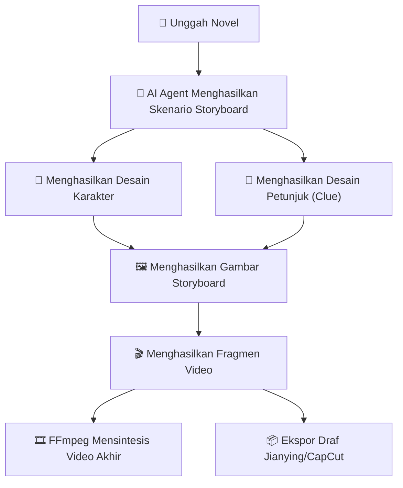
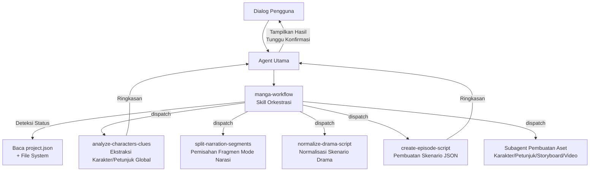
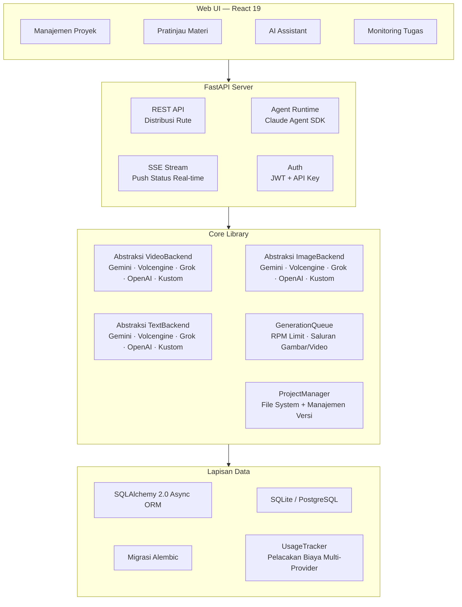

<h1 align="center">
  <br>
  <picture>
    <source media="(prefers-color-scheme: light)" srcset="frontend/public/android-chrome-maskable-512x512.png">
    <source media="(prefers-color-scheme: dark)" srcset="frontend/public/android-chrome-512x512.png">
    
  </picture>
  <br>
  ArcReel
  <br>
</h1>

<h4 align="center">Workstation Pembuatan Video AI Open-Source — Dari Novel hingga Video Pendek, Sepenuhnya Digerakkan oleh AI Agent</h4>
<h5 align="center">Open-source AI Video Generation Workspace — Novel to Short Video, Powered by AI Agents</h5>

<p align="center">
  <a href="#cepat-mulai"></a>
  <a href="https://github.com/ArcReel/ArcReel/blob/main/LICENSE"></a>
  <a href="https://github.com/ArcReel/ArcReel"></a>
  <a href="https://github.com/ArcReel/ArcReel/pkgs/container/arcreel"></a>
  <a href="https://github.com/ArcReel/ArcReel/actions/workflows/test.yml"></a>
</p>

<p align="center">
  
  
  
  
  
  
  
  
</p>

<p align="center">
  
</p>

---

## Kemampuan Inti

<table>
<tr>
<td width="20%" align="center">
<h3>🤖 Alur Kerja AI Agent</h3>
Berbasis <strong>Claude Agent SDK</strong>, orkestrasi Skill + kolaborasi multi-agent Subagent yang terfokus, mengotomatisasi seluruh lini produksi mulai dari penulisan skenario hingga sintesis video.
</td>
<td width="20%" align="center">
<h3>🎨 Pembuatan Gambar Multi-Provider</h3>
Mendukung <strong>Gemini</strong>, <strong>Volcengine</strong>, <strong>Grok</strong>, <strong>OpenAI</strong>, dan penyedia kustom. Desain karakter memastikan konsistensi peran, pelacakan petunjuk menjamin kontinuitas properti/adegan antar adegan.
</td>
<td width="20%" align="center">
<h3>🎬 Pembuatan Video Multi-Provider</h3>
Mendukung <strong>Veo 3.1</strong>, <strong>Seedance</strong>, <strong>Grok</strong>, <strong>Sora 2</strong>, dan penyedia kustom, dapat dialihkan di tingkat global atau proyek.
</td>
<td width="20%" align="center">
<h3>⚡ Antrean Tugas Asinkron</h3>
Pembatasan tingkat RPM + saluran konkurensi independen untuk Gambar/Video, penjadwalan berbasis sewa (lease-based), mendukung kelanjutan tugas yang terhenti.
</td>
<td width="20%" align="center">
<h3>🖥️ Workstation Visual</h3>
Web UI untuk manajemen proyek, pratinjau materi, rollback versi, pelacakan tugas SSE real-time, dengan asisten AI bawaan.
</td>
</tr>
</table>

## Alur Kerja



## Cepat Mulai

### Instalasi Default (SQLite)

```bash
git clone https://github.com/ArcReel/ArcReel.git
cd ArcReel/deploy
cp .env.example .env
docker compose up -d
# Akses http://localhost:1241
```

### Instalasi Produksi (PostgreSQL)

```bash
cd ArcReel/deploy/production
cp .env.example .env    # Perlu mengatur POSTGRES_PASSWORD
docker compose up -d
```

Setelah dijalankan pertama kali, login menggunakan akun default (username `admin`, password diatur di `.env` melalui `AUTH_PASSWORD`; jika tidak diatur, password akan dibuat otomatis pada saat startup pertama dan ditulis kembali ke `.env`), lalu buka **Halaman Pengaturan** (`/settings`) untuk menyelesaikan konfigurasi:

1. **Agen ArcReel** — Konfigurasi API Key Anthropic (untuk menggerakkan asisten AI), mendukung kustomisasi Base URL dan model.
2. **AI Gambar/Video** — Konfigurasi setidaknya satu API Key penyedia (Gemini / Volcengine / Grok / OpenAI), atau tambahkan penyedia kustom.

> 📖 Langkah detail silakan merujuk ke [Tutorial Lengkap Memulai](docs/getting-started.md)

## Fitur Utama

- **Lini Produksi Lengkap** — Novel → Skenario → Desain Karakter → Gambar Storyboard → Fragmen Video → Video Akhir, orkestrasi satu klik.
- **Arsitektur Multi-Agent** — Skill orkestrasi mendeteksi status proyek dan menjadwalkan Subagent yang terfokus secara otomatis. Setiap Subagent menyelesaikan tugas independen dan mengembalikan ringkasan.
- **Dukungan Multi-Provider** — Gambar/Video/Teks mendukung Gemini, Volcengine, Grok, dan OpenAI, dapat dialihkan di tingkat global atau proyek.
- **Penyedia Kustom** — Terhubung ke API apa pun yang kompatibel dengan OpenAI / Google (seperti Ollama, vLLM, agen pihak ketiga), deteksi model otomatis, dan memiliki fungsi yang sama dengan penyedia bawaan.
- **Dua Mode Konten** — Mode Narasi (narration) membagi fragmen berdasarkan ritme pembacaan, Mode Animasi Drama (drama) mengatur berdasarkan struktur adegan/dialog.
- **Perencanaan Episode Progresif** — Kolaborasi manusia-mesin untuk memotong novel panjang: deteksi peek → saran titik potong Agent → konfirmasi pengguna → pemotongan fisik, produksi sesuai kebutuhan.
- **Gambar Referensi Gaya** — Unggah gambar gaya, AI akan menganalisis dan menerapkannya secara otomatis ke semua pembuatan gambar untuk memastikan konsistensi visual seluruh proyek.
- **Konsistensi Karakter** — AI menghasilkan desain karakter terlebih dahulu, semua storyboard dan video selanjutnya akan merujuk pada desain tersebut.
- **Pelacakan Petunjuk (Clue)** — Properti kunci atau elemen adegan ditandai sebagai "Petunjuk" untuk menjaga kesinambungan visual antar adegan.
- **Riwayat Versi** — Setiap pembuatan ulang menyimpan versi historis secara otomatis, mendukung rollback satu klik.
- **Pelacakan Biaya Multi-Provider** — Gambar/Video/Teks semua dimasukkan dalam perhitungan biaya, ditagih berdasarkan strategi penyedia, dan statistik dipisahkan berdasarkan mata uang.
- **Estimasi Biaya** — Estimasi biaya proyek/episode/shot sebelum pembuatan, dengan tampilan perbandingan antara estimasi dan biaya aktual.
- **Ekspor Draf Jianying/CapCut** — Ekspor draf per episode dalam format ZIP, mendukung Jianying versi 5.x / 6+ ([Panduan Operasi](docs/jianying-export-guide.md)).
- **Impor/Ekspor Proyek** — Seluruh proyek dikemas untuk memudahkan cadangan dan migrasi.

## Dukungan Penyedia

ArcReel mendukung beberapa penyedia bawaan dan kustom melalui protokol `ImageBackend` / `VideoBackend` / `TextBackend` yang terpadu:

### Penyedia Gambar

| Penyedia | Model Tersedia | Kemampuan | Metode Penagihan |
|----------|----------------|-----------|------------------|
| **Gemini** (Google) | Nano Banana 2, Nano Banana Pro | Teks-ke-Gambar, Gambar-ke-Gambar | Berdasarkan resolusi (USD) |
| **Volcengine** (ByteDance) | Seedream 5.0, Seedream 5.0 Lite, Seedream 4.5, Seedream 4.0 | Teks-ke-Gambar, Gambar-ke-Gambar | Per gambar (CNY) |
| **Grok** (xAI) | Grok Imagine Image, Grok Imagine Image Pro | Teks-ke-Gambar, Gambar-ke-Gambar | Per gambar (USD) |
| **OpenAI** | GPT Image 1.5, GPT Image 1 Mini | Teks-ke-Gambar, Gambar-ke-Gambar | Per gambar (USD) |

### Penyedia Video

| Penyedia | Model Tersedia | Kemampuan | Metode Penagihan |
|----------|----------------|-----------|------------------|
| **Gemini** (Google) | Veo 3.1, Veo 3.1 Fast, Veo 3.1 Lite | Teks-ke-Video, Gambar-ke-Video, Ekstensi Video | Berdasarkan resolusi × durasi (USD) |
| **Volcengine** (ByteDance) | Seedance 2.0, Seedance 2.0 Fast, Seedance 1.5 Pro | Teks-ke-Video, Gambar-ke-Video, Audio, Kontrol Seed | Berdasarkan penggunaan token (CNY) |
| **Grok** (xAI) | Grok Imagine Video | Teks-ke-Video, Gambar-ke-Video | Per detik (USD) |
| **OpenAI** | Sora 2, Sora 2 Pro | Teks-ke-Video, Gambar-ke-Video | Per detik (USD) |

### Penyedia Teks

| Penyedia | Model Tersedia | Kemampuan | Metode Penagihan |
|----------|----------------|-----------|------------------|
| **Gemini** (Google) | Gemini 3.1 Flash, Gemini 3.1 Flash Lite, Gemini 3 Pro | Pembuatan Teks, Output Terstruktur, Visi | Berdasarkan penggunaan token (USD) |
| **Volcengine** (ByteDance) | Seri Doubao Seed | Pembuatan Teks, Output Terstruktur, Visi | Berdasarkan penggunaan token (CNY) |
| **Grok** (xAI) | Grok 4.20, Grok 4.1 Fast | Pembuatan Teks, Output Terstruktur, Visi | Berdasarkan penggunaan token (USD) |
| **OpenAI** | GPT-5.4, GPT-5.4 Mini, GPT-5.4 Nano | Pembuatan Teks, Output Terstruktur, Visi | Berdasarkan penggunaan token (USD) |

### Penyedia Kustom

Selain penyedia bawaan, Anda dapat menghubungkan API apa pun yang **Kompatibel dengan OpenAI** atau **Kompatibel dengan Google**:

- Tambahkan penyedia kustom di halaman pengaturan, masukkan Base URL dan API Key.
- Otomatis memanggil `/v1/models` untuk menemukan model yang tersedia dan menentukan tipe media berdasarkan nama.
- Memiliki fungsi yang sama dengan penyedia bawaan: pengalihan tingkat global/proyek, pelacakan biaya, manajemen versi.

Prioritas pemilihan penyedia: Pengaturan tingkat proyek > Default global.

## Komunitas

Pindai kode QR untuk bergabung dengan grup diskusi Feishu, dapatkan bantuan dan pembaruan terbaru:

<p align="center">
  
</p>

## Arsitektur AI Assistant

Asisten AI ArcReel dibangun di atas Claude Agent SDK, menggunakan arsitektur multi-agent **Orchestration Skill + Focused Subagent**:



**Prinsip Desain Inti**:

- **Skill Orkestrasi (manga-workflow)** — Memiliki kemampuan deteksi status, secara otomatis menentukan tahapan proyek saat ini dan menjadwalkan Subagent yang sesuai.
- **Subagent Terfokus** — Setiap Subagent hanya menyelesaikan satu tugas. Konteks besar seperti teks novel tetap berada di dalam Subagent, Agent Utama hanya menerima ringkasan singkat untuk menghemat ruang konteks.
- **Batas Skill vs Subagent** — Skill bertanggung jawab atas eksekusi skrip deterministik (panggilan API, pembuatan file), Subagent bertanggung jawab atas tugas yang memerlukan penalaran dan analisis.
- **Konfirmasi Antar Tahap** — Setelah setiap Subagent kembali, Agent Utama menampilkan ringkasan hasil kepada pengguna dan menunggu konfirmasi sebelum masuk ke tahap berikutnya.

## Integrasi OpenClaw

ArcReel mendukung pemanggilan melalui platform AI Agent eksternal seperti [OpenClaw](https://openclaw.ai), memungkinkan pembuatan video melalui bahasa alami:

1. Hasilkan API Key di pengaturan ArcReel (awalan `arc-`).
2. Muat definisi Skill ArcReel di OpenClaw (akses `http://domain-anda/skill.md`).
3. Anda dapat membuat proyek, menghasilkan skenario, dan membuat video melalui dialog di OpenClaw.

Implementasi teknis: Autentikasi API Key (Bearer Token) + Endpoint dialog Agent sinkron (`POST /api/v1/agent/chat`).

## Arsitektur Teknis



## Stack Teknologi

| Lapisan | Teknologi |
|------|------|
| **Frontend** | React 19, TypeScript, Tailwind CSS 4, wouter, zustand, Framer Motion, Vite |
| **Backend** | FastAPI, Python 3.12+, uvicorn, Pydantic 2 |
| **AI Agent** | Claude Agent SDK (Arsitektur Orchestration Skill + Subagent) |
| **Generasi Gambar** | Gemini (`google-genai`), Volcengine (`volcengine-python-sdk[ark]`), Grok (`xai-sdk`), OpenAI (`openai`) |
| **Generasi Video** | Gemini Veo 3.1 (`google-genai`), Volcengine Seedance 2.0/1.5 (`volcengine-python-sdk[ark]`), Grok (`xai-sdk`), OpenAI Sora 2 (`openai`) |
| **Generasi Teks** | Gemini (`google-genai`), Volcengine (`volcengine-python-sdk[ark]`), Grok (`xai-sdk`), OpenAI (`openai`), Instructor (Fallback output terstruktur) |
| **Pemrosesan Media** | FFmpeg, Pillow |
| **ORM & Database** | SQLAlchemy 2.0 (async), Alembic, aiosqlite, asyncpg — SQLite (Default) / PostgreSQL (Produksi) |
| **Autentikasi** | JWT (`pyjwt`), API Key (Hash SHA-256), Hash Password Argon2 (`pwdlib`) |
| **Deployment** | Docker, Docker Compose (`deploy/` default, `deploy/production/` dengan PostgreSQL) |

## Dokumentasi

- 📖 [Tutorial Lengkap Memulai](docs/getting-started.md) — Panduan langkah demi langkah dari nol.
- 📦 [Panduan Ekspor Draf Jianying](docs/jianying-export-guide.md) — Mengimpor fragmen video ke Jianying/CapCut Desktop.
- 💰 [Referensi Biaya Google GenAI](docs/google-genai-docs/Google视频&图片生成费用参考.md) — Referensi biaya gambar Gemini / video Veo.
- 💰 [Referensi Biaya Volcengine](docs/ark-docs/火山方舟费用参考.md) — Referensi biaya model video / gambar / teks Volcengine.

## Kontribusi

Kami menerima kontribusi kode, laporan Bug, atau saran fitur! Silakan merujuk ke [Panduan Kontribusi](CONTRIBUTING.md) untuk informasi tentang penyiapan lingkungan pengembangan lokal, pengujian, dan standar kode.

## Lisensi

[AGPL-3.0](LICENSE)

---

<p align="center">
  Jika proyek ini bermanfaat bagi Anda, silakan berikan ⭐ Star untuk mendukung kami!
</p>
